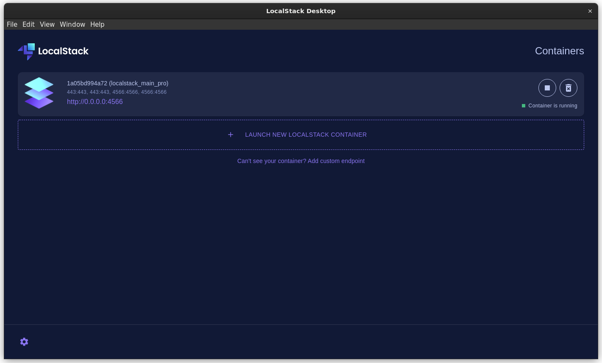
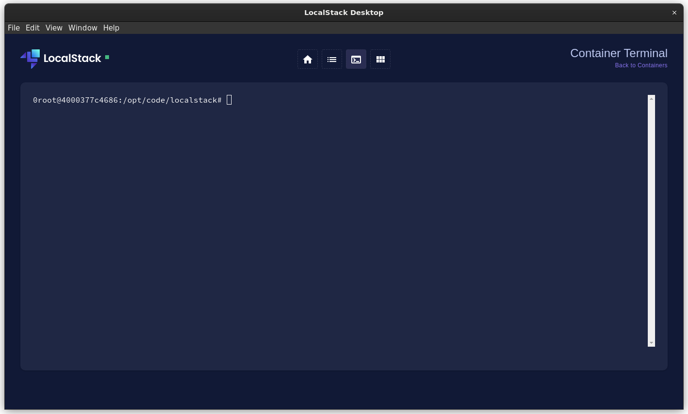
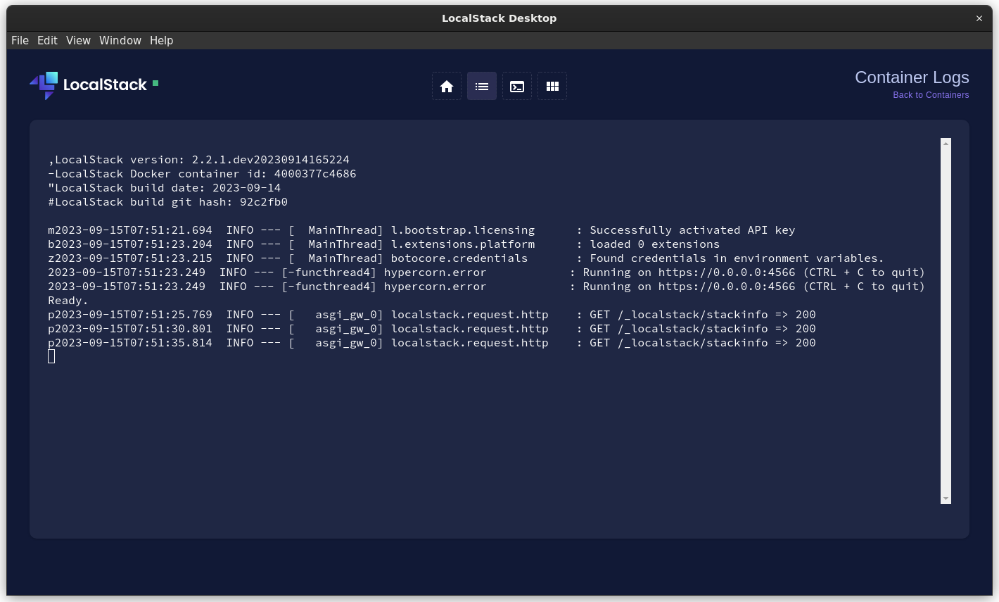
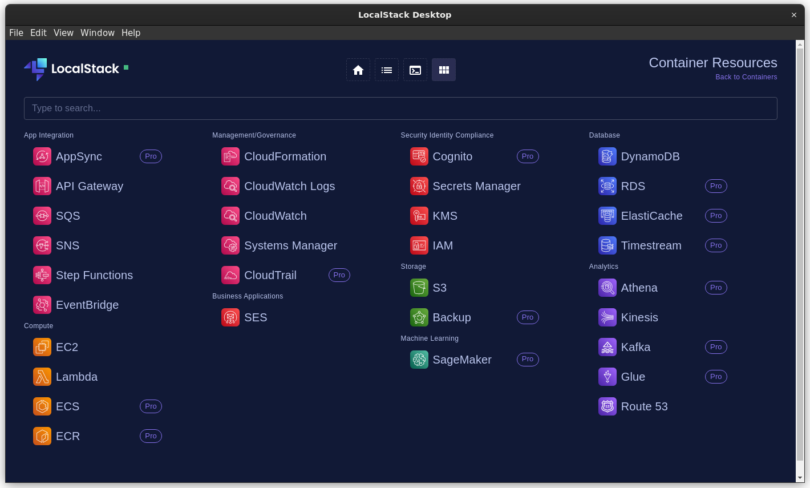

# LocalStack Desktop

The LocalStack Desktop 💻 application provides an easy way to manage your [LocalStack](https://github.com/localstack/localstack) instance.
Effortlessly start and stop LocalStack, view logs, interact with the container and use our resource browser directly in the UI.

LocalStack empowers developers to use over 75+ AWS services locally while helping them simplify their testing and development workflow.
LocalStack supports a comprehensive list of APIs, which you can view on our [Feature coverage](https://docs.localstack.cloud/user-guide/aws/feature-coverage/) page.

## Installation

You can install LocalStack Desktop by downloading the latest executables for your platform from the [web application](https://app.localstack.cloud/download) or from the [Microsoft Store](https://www.microsoft.com/store/apps/9NTRNFT9ZWS2)

## Features

Currently our desktop application support the following features

- **Control LocalStack**: Start, stop and create containers from the UI
  
- **Interact with LocaLstack**: Interact with the LocalSack container via terminal
  
- **LocalStack insights**: Check the log information of your LocalStack instance 
  
- **Resource browser**: Use the LocalStack Resource Browser to view, manage, and deploy AWS resources similar to the AWS Management Console
  
